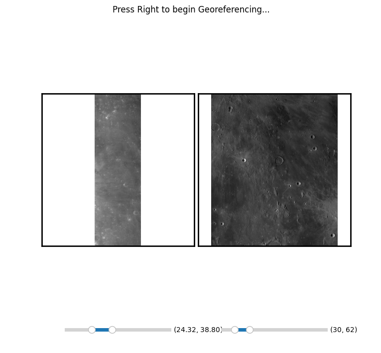

# m3georeferencer

---

M3 Georeferencer is an interactive python GUI built for hand-georeferencing Moon Mineralogy Mapper images to a global LROC WAC basemap.

## Installation

M3 Georeferencer can be directly installed from from the Python Package Index using `pip`.

```bash
pip install m3georeferencer
```

## Usage

M3 Georeferencer can be most easily accessed directly from its command-line interface CLI. To see the help menu, use:

```bash
m3georeferencer.exe -h
```

If all default arguments are used, a file named "basemap.tif" must be in your current working directory. Otherwise, the main syntax is as follows.

```bash
m3georeferencer.exe [path to binary .IMG file] [path to ENVI .HDR header file]
```

This will open a file dialog window where you can select where to save the resulting Ground Control Points (GCPs). After this dialog, the following window will open:  The following controls will allow you control the GUI:

- Middle Mouse Button: pan around image
- Scroll Wheel: Scroll in/out of image
- Left Click: Place GCP.
- Right arrow key: Advance GCP selection.

The sequence for saving one ground control point is as follows:

1) Advance GCP Selection
2) Place GCP in M3 Image
3) Advance GCP Selection
4) Place GCP in WAC Base map
5) Advance GCP

Repeat this sequence for ~50-80 Points to get a good georeference on each M3 image.
